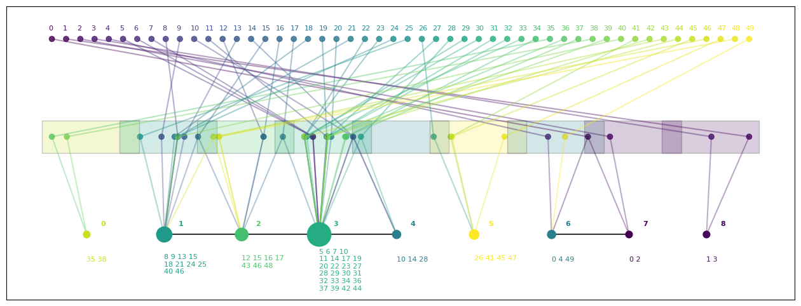
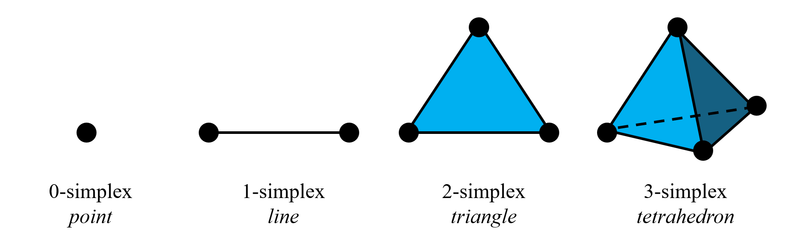

# Topological Data Analysis: The Mapper Algorithm

In this project, I applied the Mapper Algorithm to the dataset
[*Most Subscribed YouTube Channels*](https://www.kaggle.com/datasets/sukhmandeepsinghbrar/most-subscribed-youtube-channel?resource=download) and implemented an in-depth visualization that illustrates the steps that Mapper takes to generate a representation of the shape of the data via a [simplicial complex](https://en.wikipedia.org/wiki/Simplicial_complex). This required some data cleaning, variable selection and feature extraction. Also, I implemented multiple *filter functions* and visualized their results in order to determine the most adequate one. The project concludes with a particular analysis of each *cluster* to discuss the patterns within them.

## Topology

Topology is a fundamental branch of mathematics concerned with the study of [topological spaces](https://en.wikipedia.org/wiki/Topological_space) and the properties that remain invariant under continuous transformations.

Rather than focusing on distances or angles, topology emphasizes structural features such as continuity, connectedness and compactness. These properties depend only on how points are organized in a space, not on precise geometric measurements.

A key idea is that two spaces are considered equivalent (*homeomorphic*) if there exists a continuous, bijective function with a continuous inverse between them, meaning they share the same topological structure. This perspective allows topology to **classify spaces according to their intrinsic qualitative properties** rather than their exact geometric form.

To formalize this classification, topology introduces the concept of a **topological invariant**. A topological invariant is a property of a space that remains unchanged under homeomorphisms. In other words, if two spaces are homeomorphic, they must share the same values for these invariants. Examples include the number of connected components, the presence of holes, and other structural features of the space.

Topological invariants therefore provide powerful tools for distinguishing between different types of spaces and for understanding their fundamental structure.

## Simplicial Complexes

### Simplex
A $n$-simplex is a $n$-dimensional polytope formed by the [convex hull](https://en.wikipedia.org/wiki/Convex_hull) of its $n + 1$ vertices. Equivalentrly, given $n+1$ points $v_0,\cdots,v_n\in\mathbb{R}^n$ affine independent, a $n$-simplex is determined by the set

$$\left\{x_0 v_0 +\cdots + x_nv_n \ \middle| \ \sum_{j=1}^nx_j=1\ \land\ x_j\ge 0\ \forall\ j=0,\dots,n\right\}$$

See the following image for a visualization of the first 4 simplices.

The convex hull of any nonempty subset of $m$ points that define a $n$-simplex is called a $m$-face of the simplex and is a $(m-1)$-simplex itself.

### Simplicial Complex

A simplicial $n$-complex $K$ is a set of simplices such that
* Every face of $K$ is in $K$
* The non-empty intersection of any two simplices $\sigma_1,\sigma_2\in K$ is also a face of $\sigma_1$ and $\sigma_2$
* The largest dimension of any simplex in $K$ is $n$

Note that a simplicial complex may have multiple **components**. See the following figure for an example of this.

### Simplicial Complexes and Topology

Simplicial complexes provide a combinatorial way to study the topology of geometric objects. By assembling simplices according to the rules above, a simplicial complex can approximate the shape of a topological space while retaining a finite and discrete structure.

In this context, the simplices play the role of basic building blocks: vertices represent points, edges represent connections between points, triangles represent filled surfaces, and higher-dimensional simplices represent higher-dimensional analogues. The way these simplices are attached encodes the topological structure of the space.

One important property is that simplicial complexes allow the computation of topological invariants, such as connected components, holes, and voids. These features correspond to different dimensions of topological structure and can be studied through tools such as homology.

## Topological Data Analysis

Topological Data Analysis (TDA) is a relatively new area that introduces several techniques used in machine learning and data mining to understand the structure of datasets represented in high-dimensional spaces. Its theoretical framework is built upon elements of algebraic topology, particularly the study of simplicial complexes and the use of concepts such as homology and persistence. In general terms, TDA focuses on identifying patterns, clusters, and relationships within data through their topological features.

## The Mapper Algorithm
The Mapper algorithm is a TDA technique used to study high-dimensional datasets in lower-dimensional structures while preserving information about the connectivity between data points. It works by dividing the feature space using a cover and constructing a simplicial complex that represents the relationships between these regions through a clustering process applied to each subset. Mapper produces a simplified representation of the original dataset, facilitating pattern identification and improving the understanding of the underlying structure of the data.